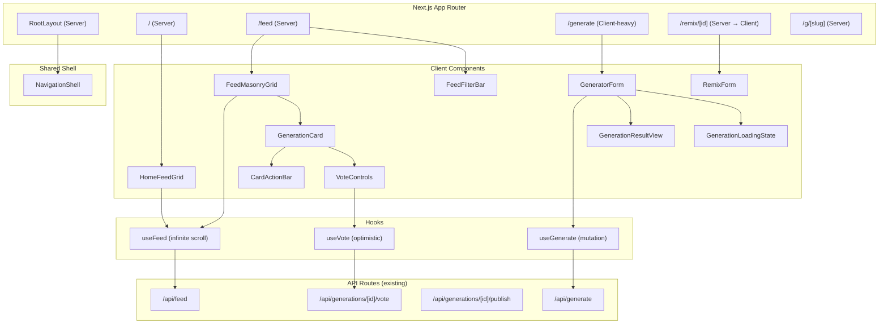

# Design Document: UI Redesign

## Overview

This design covers a full UI redesign of ifXBuiltY — transforming the current generator-first layout into a community-first, feed-forward experience. The redesign introduces a masonry card grid on the homepage, a dedicated filterable feed, a separated generation flow with wait-time engagement, and a proper remix flow with attribution.

The backend APIs (`/api/feed`, `/api/generate`, `/api/generations/[id]/publish`, `/api/generations/[id]/vote`) remain largely unchanged. This design focuses on:

1. New component architecture with a clear hierarchy
2. Responsive masonry layouts with breakpoint-aware column counts
3. Client-side state management for optimistic voting, infinite scroll, and filter state
4. Wait-time engagement during AI generation (slideshow + microcopy rotation)
5. Remix flow with pre-filled inputs and attribution tracking

### Key Design Decisions

| Decision | Rationale |
|----------|-----------|
| Client Components for interactive surfaces (cards, vote, filters) | Optimistic UI and real-time state require client-side React |
| Server Components for page shells and initial data fetch | Leverage Next.js App Router streaming and SEO |
| CSS columns for masonry (not JS-based) | Simpler, performant, no layout shift — Tailwind `columns-*` utility |
| `useInfiniteQuery`-style hook (custom) | Avoid adding react-query; keep deps minimal with a focused `useFeed` hook |
| Bottom nav on mobile via CSS media query | Single Navigation_Shell component, responsive via Tailwind breakpoints |
| `prefers-reduced-motion` media query | Disable auto-play animations globally via a CSS custom property |

## Architecture



### Data Flow

1. **Initial page load**: Server Components fetch the first page of feed data via `fetchFeedServer()` and pass it as props to client components (avoids waterfall).
2. **Infinite scroll**: Client-side `useFeed` hook fetches subsequent pages from `/api/feed?sort=...&offset=...&limit=20`.
3. **Voting**: `useVote` hook applies optimistic update to local state, fires POST to `/api/generations/[id]/vote`, reverts on error.
4. **Generation**: `useGenerate` hook manages the full lifecycle: submit → loading state → result/error.
5. **Filters**: URL search params (`?sort=trending&builder=X&target=Y`) drive filter state; `useFeed` re-fetches when params change.

## Components and Interfaces

### Component Hierarchy

```
RootLayout
├── NavigationShell
│   ├── Logo + Wordmark
│   ├── NavLinks (Home, Feed, Generate)
│   ├── UserAvatar / SignInButton
│   └── [Mobile: BottomTabBar]
│
├── HomePage (/)
│   ├── HeroSection (headline + CTA)
│   └── HomeFeedGrid
│       └── GenerationCard[] (12+ above fold)
│
├── FeedPage (/feed)
│   ├── FeedHeader (title + description)
│   ├── FeedFilterBar
│   │   ├── SortTabs (Trending | Newest | Top)
│   │   ├── BuilderFilter (multi-select dropdown)
│   │   └── TargetFilter (multi-select dropdown)
│   ├── FeedMasonryGrid
│   │   └── GenerationCard[]
│   └── InfiniteScrollSentinel
│
├── GeneratePage (/generate)
│   ├── GeneratorForm
│   │   ├── BuilderInput
│   │   ├── TargetInput
│   │   ├── SecondaryControls (tone, screenType, region, extraDetails)
│   │   ├── GenerateButton / SignInPrompt
│   │   └── ErrorDisplay
│   ├── GenerationLoadingState
│   │   ├── ShowcaseSlideshow
│   │   ├── MicrocopyRotator
│   │   └── IndeterminateProgress
│   └── GenerationResultView
│       ├── HeroImage
│       ├── TitleBar ("if [Builder] built [Target]")
│       ├── ActionPills (publish, share, download, remix)
│       └── RegenerateButton
│
├── RemixPage (/remix/[id])
│   ├── AttributionStrip (source label + thumbnail)
│   └── RemixForm (extends GeneratorForm, pre-filled)
│
└── DetailPage (/g/[slug])
    ├── HeroImage
    ├── GenerationMeta (title, tone, details)
    ├── VoteControls
    ├── ActionButtons (remix, download, share)
    └── RelatedGrid
```

### Key Component Interfaces

```typescript
// NavigationShell
type NavigationShellProps = {
  user: User | null;
  activeSection: "home" | "feed" | "generate";
};

// GenerationCard
type GenerationCardProps = {
  item: FeedItem;
  /** Controls hover action bar visibility (desktop only) */
  showActions?: boolean;
};

// VoteControls
type VoteControlsProps = {
  generationId: number;
  initialScore: number;
  initialUserVote: 1 | -1 | null;
  compact?: boolean; // true for card, false for detail page
};

// FeedFilterBar
type FeedFilterBarProps = {
  currentSort: FeedSort;
  builders: string[];
  targets: string[];
  selectedBuilders: string[];
  selectedTargets: string[];
  onSortChange: (sort: FeedSort) => void;
  onBuildersChange: (builders: string[]) => void;
  onTargetsChange: (targets: string[]) => void;
};

// GeneratorForm
type GeneratorFormProps = {
  signedIn: boolean;
  initialValues?: Partial<GenerationInputs>;
  remixSource?: RemixSource | null;
  onGenerated: (result: GenerationResult) => void;
};

type GenerationInputs = {
  builder: string;
  target: string;
  tone: string;
  screenType: string;
  region: string;
  extraDetails: string;
};

type GenerationResult = {
  id: number;
  slug: string;
  imageUrl: string | null;
  builder: string;
  target: string;
};

type RemixSource = {
  id: number;
  label: string; // "if [builder] built [target]"
  imageUrl: string | null;
};

// GenerationLoadingState
type GenerationLoadingStateProps = {
  showcaseExamples: ShowcaseExample[];
};

// FeedMasonryGrid
type FeedMasonryGridProps = {
  initialItems: FeedItem[];
  sort: FeedSort;
  builders?: string[];
  targets?: string[];
};
```

### Custom Hooks

```typescript
// useFeed — infinite scroll with filter support
function useFeed(options: {
  sort: FeedSort;
  builders?: string[];
  targets?: string[];
  initialItems?: FeedItem[];
  pageSize?: number;
}): {
  items: FeedItem[];
  isLoading: boolean;
  hasMore: boolean;
  loadMore: () => void;
  error: string | null;
};

// useVote — optimistic voting
function useVote(options: {
  generationId: number;
  initialScore: number;
}): {
  score: number;
  userVote: 1 | -1 | null;
  vote: (value: 1 | -1) => void;
  isPending: boolean;
  error: string | null;
};

// useGenerate — generation lifecycle
function useGenerate(): {
  generate: (inputs: GenerationInputs) => Promise<void>;
  result: GenerationResult | null;
  isLoading: boolean;
  error: string | null;
  reset: () => void;
};
```

## Data Models

### Existing Database Schema (unchanged)

The `generations` table already contains all fields needed:

| Column | Type | Notes |
|--------|------|-------|
| id | serial | PK |
| slug | text | URL-safe identifier |
| builder | text | Builder name |
| target | text | Target name |
| tone | text | Tone descriptor |
| screen_type | text | Screen format |
| region | text | Cultural region |
| extra_details | text | Free-form details |
| image_path | text | Supabase storage path |
| visibility | text | "draft" / "published" |
| moderation_status | text | "visible" / "hidden" |
| upvote_count | int | Aggregate upvotes |
| downvote_count | int | Aggregate downvotes |
| net_score | int | upvote_count - downvote_count |
| remix_count | int | Number of remixes |
| parent_generation_id | int | FK to parent (remix source) |
| user_id | uuid | FK to auth.users |
| created_at | timestamptz | Creation timestamp |

### Client-Side State Shape

```typescript
// Feed page URL state (synced to searchParams)
type FeedPageState = {
  sort: "trending" | "newest" | "top";
  builders: string[];   // selected builder filters
  targets: string[];    // selected target filters
};

// Generation page local state
type GeneratePageState = {
  phase: "input" | "loading" | "result" | "error";
  inputs: GenerationInputs;
  result: GenerationResult | null;
  error: string | null;
  remixSource: RemixSource | null;
};

// Card vote state (per-card, managed by useVote)
type CardVoteState = {
  score: number;
  userVote: 1 | -1 | null;
  isPending: boolean;
};
```

### API Contract Extensions

The existing `/api/feed` route needs minor extensions for the redesign:

```typescript
// Extended query params
GET /api/feed?sort=trending|newest|top
             &limit=20
             &offset=0
             &builder=Duolingo,Apple    // comma-separated filter
             &target=LinkedIn,Tinder    // comma-separated filter

// Response shape (unchanged)
type FeedResponse = {
  sort: FeedSort;
  items: FeedItem[];
  hasMore: boolean;  // NEW: signals if more pages exist
};
```

The `top` sort option orders by `net_score DESC` without recency weighting. The `offset` param enables cursor-based pagination for infinite scroll.

### Masonry Layout Strategy

CSS multi-column layout via Tailwind utilities:

```
Mobile (<640px):    columns-1
Tablet (640-1023):  columns-2
Small desktop (1024-1279): columns-3
Large desktop (≥1280):     columns-5
```

Cards use `break-inside-avoid` to prevent splitting across columns. Variable card heights (driven by image aspect ratio) create the masonry effect naturally.


## Correctness Properties

*A property is a characteristic or behavior that should hold true across all valid executions of a system — essentially, a formal statement about what the system should do. Properties serve as the bridge between human-readable specifications and machine-verifiable correctness guarantees.*

### Property 1: Feed visibility filtering

*For any* set of generation records with mixed `visibility` and `moderation_status` values, the feed query SHALL return only those records where `visibility = "published"` AND `moderation_status = "visible"` — no other records shall appear in the result.

**Validates: Requirements 1.1**

### Property 2: Trending sort order

*For any* list of FeedItems returned with sort="trending", each item's `net_score` SHALL be greater than or equal to the next item's `net_score`, and for items with equal `net_score`, the `created_at` timestamp SHALL be greater than or equal to the next item's `created_at`.

**Validates: Requirements 1.6**

### Property 3: Optimistic vote with revert on error

*For any* card with initial score N and any vote direction (+1 or -1), the displayed score SHALL immediately update to N+1 or N-1 respectively before the server responds, and SHALL revert to N if the server returns an error response.

**Validates: Requirements 1.7**

### Property 4: Feed filtering with intersection logic

*For any* set of FeedItems and any combination of selected builder values and selected target values, the filtered result SHALL contain only items where the item's builder is in the selected builders set AND the item's target is in the selected targets set. When only one filter type is active, items need only match that filter.

**Validates: Requirements 2.3, 2.4, 2.5**

### Property 5: Infinite scroll pagination

*For any* feed state, calling loadMore when `hasMore = true` SHALL append between 1 and 20 new items to the existing list without removing or reordering existing items. When `hasMore = false`, calling loadMore SHALL not modify the items list or trigger a network request.

**Validates: Requirements 1.5, 2.9, 2.11**

### Property 6: Card label formatting with truncation

*For any* builder string and target string, the card label SHALL equal `"{builder} built {target}"` when the combined string is 60 characters or fewer, and SHALL be truncated to 60 characters with a trailing ellipsis ("…") when the combined string exceeds 60 characters.

**Validates: Requirements 3.2**

### Property 7: Compact number formatting

*For any* integer n, `formatCompactCount(n)` SHALL produce: the raw number as a string when |n| < 1000, and a string in the format "{X}k" (with one decimal place when not a whole number of thousands) when |n| ≥ 1000. Negative numbers SHALL be prefixed with "−".

**Validates: Requirements 3.3**

### Property 8: Remix count conditional display

*For any* FeedItem, the card SHALL display the remix count as a visible label if and only if `remixCount >= 1`. When `remixCount === 0`, no remix count label SHALL be rendered.

**Validates: Requirements 3.8**

### Property 9: Generate button input validation

*For any* pair of strings (builder, target), the Generate action SHALL be enabled if and only if `builder.trim().length > 0` AND `target.trim().length > 0`. For all other cases (either field empty or whitespace-only), the Generate action SHALL be disabled.

**Validates: Requirements 4.3, 4.4**

### Property 10: Form input preservation on generation error

*For any* set of GenerationInputs (builder, target, tone, screenType, region, extraDetails), if generation fails, all form fields SHALL retain their exact pre-submission values. Activating retry SHALL re-submit the request with the identical preserved input values.

**Validates: Requirements 5.6, 5.7**

### Property 11: Result title formatting

*For any* builder and target strings in a completed generation, the result view title SHALL be displayed as exactly `"if {builder} built {target}"`.

**Validates: Requirements 6.3**

### Property 12: Remix pre-fill from source

*For any* source generation with fields (builder, target, tone, screenType, region, extraDetails), opening the remix flow SHALL pre-fill the form with the exact values from the source generation for all six fields.

**Validates: Requirements 6.6, 7.1**

### Property 13: Reset clears to defaults

*For any* GeneratePageState in the "result" phase with any combination of user-entered values, activating "Generate another" SHALL clear the result, reset all form fields to their default values, and return the page to the "input" phase.

**Validates: Requirements 6.7**

### Property 14: Regenerate enabled on input change

*For any* GeneratePageState in the "result" phase, if any input field (builder, target, tone, screenType, region, or extraDetails) differs from the values used in the last successful generation, the Regenerate action SHALL be enabled. If all fields match the last generation's values, Regenerate SHALL be disabled.

**Validates: Requirements 6.8**

### Property 15: Reduced motion compliance

*For any* component with auto-playing animations or transitions, when the user's operating system reports `prefers-reduced-motion: reduce`, all auto-playing animations SHALL be stopped (static equivalents shown) and all CSS transition durations SHALL be set to 0ms.

**Validates: Requirements 9.7**

## Error Handling

### Network Errors

| Scenario | Behavior |
|----------|----------|
| Feed fetch fails (initial load) | Show empty state with "Something went wrong" message and retry button |
| Feed fetch fails (infinite scroll) | Show inline error below existing cards, auto-retry once after 3s |
| Vote API fails | Revert optimistic score, show brief toast "Vote failed" for 3s |
| Generation API fails | Show inline error in generator form, re-enable Generate button, preserve all inputs |
| Publish API fails | Show inline error "Could not publish", keep result and unpublished state |
| Image fails to load (card) | Show placeholder with builder/target label as primary visual |
| Image fails to load (result) | Show error state with "Image unavailable" and option to regenerate |

### Auth Errors

| Scenario | Behavior |
|----------|----------|
| Session expired during vote | Silently fail, show "Sign in to vote" tooltip on next attempt |
| Session expired during generation | Redirect to login with `?next=/generate` preserving form state in URL params |
| Session expired during publish | Show "Please sign in again" with link to login |

### Edge Cases

| Scenario | Behavior |
|----------|----------|
| Remix source deleted/unpublished | Show error "Source generation is no longer available", disable submit |
| Extremely long builder/target names | Truncate at 60 chars with ellipsis in card label; full text in detail view |
| Zero published generations in feed | Show empty state with CTA to generate |
| Concurrent votes on same card | Last-write-wins; optimistic UI may briefly show stale count |
| Generation timeout (>60s) | Show "Taking longer than expected..." message, keep waiting up to 120s, then show timeout error with retry |

## Testing Strategy

### Unit Tests (Example-Based)

Focus on specific scenarios and edge cases:

- **NavigationShell**: Renders correct links, shows avatar when signed in, shows sign-in when not, switches to bottom nav on mobile
- **GenerationCard**: Renders image, label, vote score; shows placeholder on image error; hides action bar by default on desktop
- **FeedFilterBar**: Renders all sort options; calls handlers on selection
- **GeneratorForm**: Shows sign-in prompt when not authenticated; disables button during loading; shows error messages
- **GenerationLoadingState**: Shows slideshow, microcopy, progress indicator; falls back to static placeholder
- **GenerationResultView**: Displays image at correct constraints; shows all action pills

### Property-Based Tests

Using **vitest** with **fast-check** for property-based testing. Each property test runs a minimum of 100 iterations.

| Property | Module Under Test | Generator Strategy |
|----------|-------------------|-------------------|
| P1: Feed visibility filtering | `filterFeedItems()` | Random arrays of generation records with random visibility/moderation values |
| P2: Trending sort order | `sortFeedItems("trending")` | Random arrays of FeedItems with random net_score and created_at |
| P3: Optimistic vote revert | `useVote` hook | Random initial scores, random vote directions, random server responses |
| P4: Feed filtering intersection | `applyFeedFilters()` | Random FeedItem arrays, random subsets of builder/target values |
| P5: Infinite scroll pagination | `useFeed` hook | Random initial item arrays, random hasMore states |
| P6: Card label truncation | `formatCardLabel()` | Random strings of varying lengths for builder and target |
| P7: Compact number formatting | `formatCompactCount()` | Random integers across full range |
| P8: Remix count display | `GenerationCard` render | Random FeedItems with remixCount 0..N |
| P9: Input validation | `isGenerateEnabled()` | Random strings including empty, whitespace-only, and valid text |
| P10: Form preservation | `useGenerate` hook | Random GenerationInputs with simulated failures |
| P11: Result title | `formatResultTitle()` | Random builder/target strings |
| P12: Remix pre-fill | Remix page loader | Random source generation objects with all fields |
| P13: Reset to defaults | `useGenerate.reset()` | Random form states |
| P14: Regenerate enabled | `hasInputsChanged()` | Random pairs of GenerationInputs (current vs last) |
| P15: Reduced motion | CSS/component render | Components with animations rendered under reduced-motion media query |

### Integration Tests

- Full page render tests for each route (/, /feed, /generate, /remix/[id], /g/[slug])
- API route tests for `/api/feed` with various query params
- Publish flow end-to-end (generate → publish → verify in feed)
- Vote flow end-to-end (vote → verify count update)

### Test Configuration

```typescript
// vitest.config.ts additions
export default defineConfig({
  test: {
    // Property tests tagged with feature name
    // Tag format: Feature: ui-redesign, Property {N}: {title}
  },
});
```

Property test tag format: `Feature: ui-redesign, Property {number}: {property_text}`

Each property-based test must:
1. Run minimum 100 iterations
2. Reference its design document property number in a comment
3. Use fast-check arbitraries for input generation
4. Test a single property per test function
